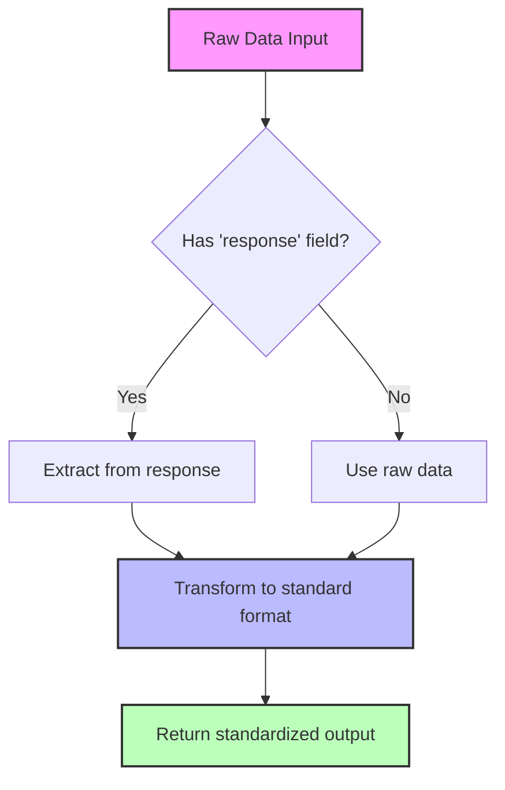
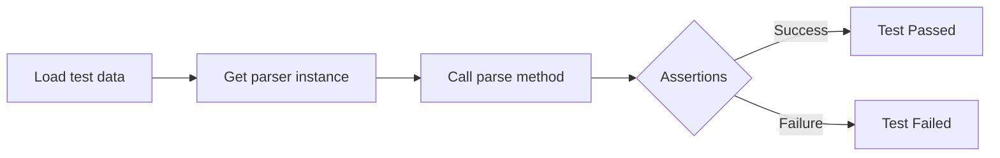
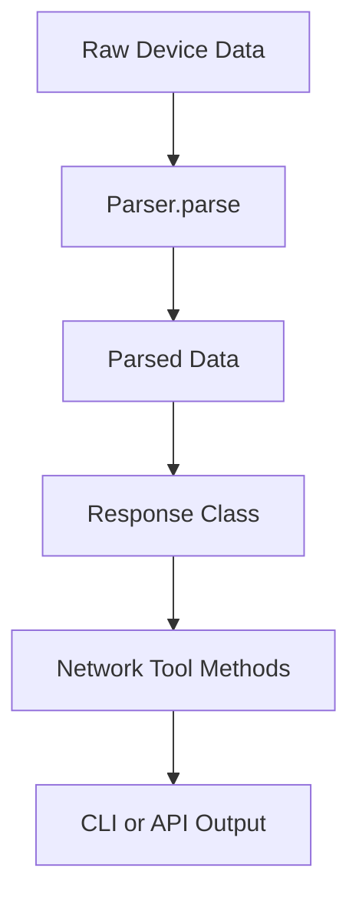

# Parser Framework Developer Guide

This guide explains how to create and integrate new parsers into the framework. The parser system is designed to consistently handle different data formats from various network devices.

## Architecture Overview

The parser architecture consists of the following components:

1. **Base Parser Interfaces**: Abstract classes that define the basic interface for all parsers.
2. **Domain-Specific Parser Interfaces**: Interfaces for specific domains like interfaces, protocols, etc.
3. **Concrete Parser Implementations**: Implementations for specific device types and data types.
4. **Parser Factory**: A factory class for creating parser instances based on device type and data type.

### Class Hierarchy

````mermaid
classDiagram
    class BaseParser {
        <<abstract>>
        +parse(data): Dict
        +extract_data(data): Dict
        +transform_data(extracted_data): Dict
        +get_timestamp(data): Optional[int]
    }

    class GnmiDataParser {
        <<abstract>>
        +parse(data): Dict
        +extract_data(data): Dict
        +transform_data(extracted_data): Dict~abstract~
    }

    class InterfaceParser {
        <<abstract>>
        +transform_data(extracted_data): Dict
        +process_interfaces(data): List[Dict]
        +extract_interface(item): Optional[Dict]~abstract~
        +is_single_interface(): bool
        +get_empty_interface(): Dict
    }

    class ProtocolParser {
        <<abstract>>
        +transform_data(extracted_data): Dict
    }

    class LogParser {
        <<abstract>>
        +transform_data(extracted_data): Dict
    }

    BaseParser <|-- GnmiDataParser
    GnmiDataParser <|-- InterfaceParser
    GnmiDataParser <|-- ProtocolParser
    GnmiDataParser <|-- LogParser

    class SingleInterfaceParser {
        +is_single_interface(): bool
    }

    class InterfaceBriefParser {
        +is_single_interface(): bool
    }

    class VrfParser {
        +transform_data(extracted_data): Dict
    }

    class RoutingParser {
        +transform_data(extracted_data): Dict
    }

    class MplsParser {
        +transform_data(extracted_data): Dict
    }

    class BgpParser {
        +transform_data(extracted_data): Dict
    }

    class IsisParser {
        +transform_data(extracted_data): Dict
    }

    InterfaceParser <|-- SingleInterfaceParser
    InterfaceParser <|-- InterfaceBriefParser
    ProtocolParser <|-- VrfParser
    ProtocolParser <|-- RoutingParser
    ProtocolParser <|-- MplsParser
    RoutingParser <|-- BgpParser
    RoutingParser <|-- IsisParser

    class ParserFactory {
        -_parser_registry: Dict
        +get_parser(device_type, parser_type): BaseParser
        +get_interface_parser(device_type, single): InterfaceParser
        +get_protocol_parser(device_type, protocol_type): ProtocolParser
        +get_log_parser(device_type): LogParser
        +register_parser(device_type, parser_type, parser_class): None
    }

    ParserFactory --> BaseParser
```

## Parser Data Flow

The typical data flow through the parser system:

```mermaid
flowchart TD
    A[Raw Device Data] --> B[Parser.parse]
    B --> C[extract_data]
    C --> D[transform_data]
    D --> E[Standardized Output]

    subgraph "Domain-Specific Processing"
    D --> F[Domain processing methods]
    F --> G[Domain extraction methods]
    end
````

## Base Parser Interface

All parsers implement the `BaseParser` interface, which defines the following methods:

- `parse(data)`: The main entry point for parsing data. Takes raw input data and returns structured output data.
- `extract_data(data)`: Extracts relevant data from the input structure.
- `transform_data(extracted_data)`: Transforms extracted data into the final output format.

For parsers that specifically work with gNMI data, there's also a `GnmiDataParser` class that adds gNMI-specific functionality:

```python
class BaseParser(Generic[T_Input, T_Output], ABC):
    @abstractmethod
    def parse(self, data: T_Input) -> T_Output:
        """Parse the input data and return structured output data."""
        pass

    @abstractmethod
    def extract_data(self, data: T_Input) -> Dict[str, Any]:
        """Extract relevant data from the input structure."""
        pass

    @abstractmethod
    def transform_data(self, extracted_data: Dict[str, Any]) -> T_Output:
        """Transform extracted data into the final output format."""
        pass
```

## Domain-Specific Parser Interfaces

### Interface Parsers

Interface parsers implement the `InterfaceParser` interface, with specialized subclasses for:

- `SingleInterfaceParser`: For detailed information about a single interface.
- `InterfaceBriefParser`: For summary information about multiple interfaces.

### Protocol Parsers

Protocol parsers implement the `ProtocolParser` interface, with specialized subclasses for:

- `VrfParser`: For parsing VRF data.
- `MplsParser`: For parsing MPLS data.
- `RoutingParser`: Base class for routing protocol parsers, with further specialization for:
  - `BgpParser`: For BGP data.
  - `IsisParser`: For IS-IS data.

### Log Parsers

Log parsers implement the `LogParser` interface for parsing system logs.

## Using Parsers

The `ParserFactory` class provides methods for creating parser instances based on device type and data type:

```python
from src.parsers.factory import ParserFactory, CISCO_IOSXR, INTERFACE_SINGLE

# Create a parser for a single interface on a Cisco IOS-XR device
parser = ParserFactory.get_parser(CISCO_IOSXR, INTERFACE_SINGLE)

# Parse data using the parser
parsed_data = parser.parse(raw_data)
```

The factory also provides convenience methods for creating specific types of parsers:

```python
# Get an interface parser
interface_parser = ParserFactory.get_interface_parser(CISCO_IOSXR, single=True)

# Get a protocol parser for VRF data
vrf_parser = ParserFactory.get_protocol_parser(CISCO_IOSXR, 'vrf')

# Get a log parser
log_parser = ParserFactory.get_log_parser(CISCO_IOSXR)
```

## How to Create a New Parser

### Step 1: Choose the Right Parent Interface

First, determine what type of data you're parsing and choose the appropriate interface:

- For interface data: extend from `SingleInterfaceParser` or `InterfaceBriefParser`
- For protocol data: extend from the appropriate protocol parser interface (`VrfParser`, `BgpParser`, etc.)
- For log data: extend from `LogParser`

If none of the existing interfaces fit your needs, you might need to create a new domain-specific interface that extends `GnmiDataParser`.

### Step 2: Create Your Parser Class

Create a new file for your parser in the appropriate directory:

```python
# src/parsers/interfaces/example_vendor_interface_parser.py
from src.parsers.interfaces.parser_interface import SingleInterfaceParser
from typing import Dict, Any, Optional

class ExampleVendorSingleInterfaceParser(SingleInterfaceParser):
    """Parser for single interface data from Example Vendor devices."""

    def extract_interface(self, item: Dict[str, Any]) -> Optional[Dict[str, Any]]:
        """Extract interface information from vendor-specific data structure."""
        # Initialize empty interface with standard fields
        interface = self.get_empty_interface()

        path = item.get("path", "")
        val = item.get("val", {})

        # Extract basic interface information - customize for your vendor's data structure
        if "name" in val:
            interface["name"] = val["name"]

        # Extract additional information based on device-specific structures
        if "state" in val:
            state = val["state"]
            interface["admin_state"] = state.get("admin-status")
            interface["oper_state"] = state.get("oper-status")
            # etc...

        return interface
```

### Step 3: Update the Parser Factory

Add your parser to the registry in the ParserFactory class:

```python
# In factory.py
from src.parsers.interfaces.example_vendor_interface_parser import ExampleVendorSingleInterfaceParser

# Add constants for your vendor if needed
EXAMPLE_VENDOR = "example_vendor"

class ParserFactory:
    # Update the registry
    _parser_registry = {
        CISCO_IOSXR: {
            # existing parsers
        },
        EXAMPLE_VENDOR: {
            INTERFACE_SINGLE: ExampleVendorSingleInterfaceParser,
            # other parser types for this vendor
        }
    }
```

Alternatively, register your parser externally:

```python
from src.parsers.factory import ParserFactory, INTERFACE_SINGLE
from src.parsers.interfaces.example_vendor_interface_parser import ExampleVendorSingleInterfaceParser

# Register the parser
ParserFactory.register_parser(EXAMPLE_VENDOR, INTERFACE_SINGLE, ExampleVendorSingleInterfaceParser)
```

### Step 4: Create Tests

Create test cases that verify your parser correctly handles both valid and invalid data:

```python
# tests/parsers/test_example_vendor_parsers.py
import pytest
from src.parsers.factory import ParserFactory, EXAMPLE_VENDOR, INTERFACE_SINGLE

class TestExampleVendorParsers:
    def test_single_interface_parser(self):
        # Prepare test data
        test_data = {
            "response": [
                {
                    "path": "interfaces/interface[name=Eth1/1]",
                    "val": {
                        "name": "Eth1/1",
                        "state": {
                            "admin-status": "UP",
                            "oper-status": "UP"
                        }
                    }
                }
            ]
        }

        # Get the parser
        parser = ParserFactory.get_parser(EXAMPLE_VENDOR, INTERFACE_SINGLE)

        # Parse the data
        result = parser.parse(test_data)

        # Verify the result
        assert "interface" in result
        assert result["interface"]["name"] == "Eth1/1"
        assert result["interface"]["admin_state"] == "UP"
```

## Standard Output Formats

For consistency, all parsers within the same domain should output data in the same format, regardless of the input data structure or device type.

### Interface Parser Output

```json
{
  "interface": {
    // For single interface parsers
    "name": "GigabitEthernet0/0/0/0",
    "admin_state": "UP",
    "oper_state": "UP",
    "description": "Connection to Switch",
    "mtu": 1500,
    "mac_address": "00:11:22:33:44:55",
    "speed": "1G",
    "duplex": "FULL",
    "ip_addresses": [
      {
        "ip": "192.168.1.1",
        "prefix_length": 24,
        "subnet": "192.168.1.0/24"
      }
    ],
    "vrf": "default",
    "counters": {
      "in_packets": 1000,
      "out_packets": 500,
      "in_errors": 0,
      "out_errors": 0
    }
  }
}
```

### VRF Parser Output

```json
{
  "vrfs": [
    {
      "name": "VRF1",
      "description": "Customer VRF",
      "route_distinguisher": "65000:1",
      "import_targets": ["65000:1", "65000:10"],
      "export_targets": ["65000:1"],
      "interfaces": ["GigabitEthernet0/0/0/1"],
      "address_families": ["ipv4", "ipv6"]
    }
  ],
  "summary": {
    "total_vrfs": 1,
    "active_vrfs": 1
  }
}
```

## Best Practices for Parser Development

1. **Follow the extract/transform pattern**:

   - `extract_data()`: Get the relevant data from the input structure
   - `transform_data()`: Convert the extracted data to the standard output format

2. **Maintain type safety**:

   - Use Python type hints to document input/output types
   - Include null checks and defaults for optional fields

3. **Error handling**:

   - Handle missing or malformed data gracefully
   - Provide useful error messages when data can't be parsed

4. **Testing**:

   - Create tests with real device data samples
   - Test edge cases (empty data, malformed data, etc.)

5. **Code organization**:
   - Group parsers by device type and data domain
   - Use consistent naming conventions (`{vendor}_{data_type}_parser.py`)

## Common Parser Implementation Patterns



## Testing Parsers

The test module `tests/parsers/test_parser_interfaces.py` provides examples of how to test parsers with sample data.

### Example Test Pattern



## Parser Troubleshooting Guide

### Parser Issues and Solutions

| Issue                             | Solution                                                                               |
| --------------------------------- | -------------------------------------------------------------------------------------- |
| `NotFoundError` when parsing data | Ensure the parser is extracting data from the correct path                             |
| Missing fields in output          | Provide default values for all fields in `get_empty_interface()` or equivalent methods |
| Inconsistent output format        | Use the standard output formats for your domain type                                   |
| Parser not found in factory       | Ensure your parser is registered in `ParserFactory._parser_registry`                   |
| TypeError when parsing            | Check that your parser correctly handles the data structure type it receives           |

## Troubleshooting

### Common Issues and Solutions

| Issue                             | Solution                                                                               |
| --------------------------------- | -------------------------------------------------------------------------------------- |
| `NotFoundError` when parsing data | Ensure the parser is extracting data from the correct path                             |
| Missing fields in output          | Provide default values for all fields in `get_empty_interface()` or equivalent methods |
| Inconsistent output format        | Use the standard output formats for your domain type                                   |
| Parser not found in factory       | Ensure your parser is registered in `ParserFactory._parser_registry`                   |
| TypeError when parsing            | Check that your parser correctly handles the data structure type it receives           |

## Troubleshooting

### Common Issues and Solutions

| Issue                             | Solution                                                                               |
| --------------------------------- | -------------------------------------------------------------------------------------- |
| `NotFoundError` when parsing data | Ensure the parser is extracting data from the correct path                             |
| Missing fields in output          | Provide default values for all fields in `get_empty_interface()` or equivalent methods |
| Inconsistent output format        | Use the standard output formats for your domain type                                   |
| Parser not found in factory       | Ensure your parser is registered in `ParserFactory._parser_registry`                   |
| TypeError when parsing            | Check that your parser correctly handles the data structure type it receives           |

### Debugging Tips

1. Use `print()` or logging to debug parser flow:

   ```python
   import logging
   logger = logging.getLogger(__name__)

   def extract_interface(self, item):
       logger.debug(f"Extracting interface from item: {item}")
       # ...
   ```

2. Test with simplified data structures first, then add complexity.

3. When adding support for a new vendor, start by examining real device output.

4. Use the test framework to validate your parser against real-world data.

## Integration with Response Classes

Parsers work closely with response classes defined in `src.network_tools.responses` to ensure parsed data is correctly packaged for the rest of the application:


