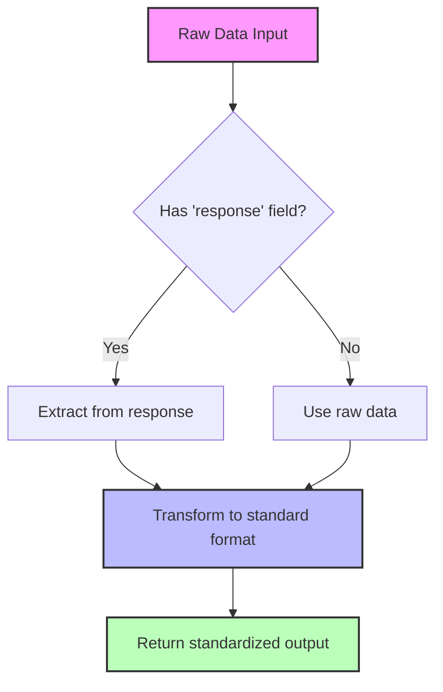
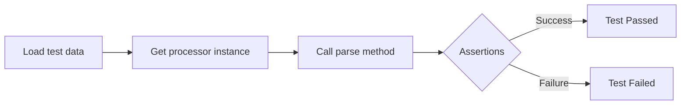
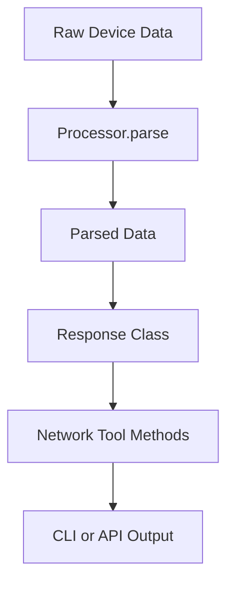

# Processor Framework Developer Guide

This guide explains how to create and integrate new processors into the framework. The processor system is designed to consistently handle different data formats from various network devices.

## Architecture Overview

The processor architecture consists of the following components:

1. **Base Processor Interfaces**: Abstract classes that define the basic interface for all processors.
2. **Domain-Specific Processor Interfaces**: Interfaces for specific domains like interfaces, protocols, etc.
3. **Concrete Processor Implementations**: Implementations for specific device types and data types.
4. **Processor Factory**: A factory class for creating processor instances based on device type and data type.

### Class Hierarchy

````mermaid
classDiagram
    class BaseProcessor {
        <<abstract>>
        +parse(data): Dict
        +extract_data(data): Dict
        +transform_data(extracted_data): Dict
        +get_timestamp(data): Optional[int]
    }

    class GnmiDataProcessor {
        <<abstract>>
        +parse(data): Dict
        +extract_data(data): Dict
        +transform_data(extracted_data): Dict~abstract~
    }

    class InterfaceProcessor {
        <<abstract>>
        +transform_data(extracted_data): Dict
        +process_interfaces(data): List[Dict]
        +extract_interface(item): Optional[Dict]~abstract~
        +is_single_interface(): bool
        +get_empty_interface(): Dict
    }

    class ProtocolProcessor {
        <<abstract>>
        +transform_data(extracted_data): Dict
    }

    class LogProcessor {
        <<abstract>>
        +transform_data(extracted_data): Dict
    }

    BaseProcessor <|-- GnmiDataProcessor
    GnmiDataProcessor <|-- InterfaceProcessor
    GnmiDataProcessor <|-- ProtocolProcessor
    GnmiDataProcessor <|-- LogProcessor

    class SingleInterfaceProcessor {
        +is_single_interface(): bool
    }

    class InterfaceBriefProcessor {
        +is_single_interface(): bool
    }

    class VrfProcessor {
        +transform_data(extracted_data): Dict
    }

    class RoutingProcessor {
        +transform_data(extracted_data): Dict
    }

    class MplsProcessor {
        +transform_data(extracted_data): Dict
    }

    class BgpProcessor {
        +transform_data(extracted_data): Dict
    }

    class IsisProcessor {
        +transform_data(extracted_data): Dict
    }

    InterfaceProcessor <|-- SingleInterfaceProcessor
    InterfaceProcessor <|-- InterfaceBriefProcessor
    ProtocolProcessor <|-- VrfProcessor
    ProtocolProcessor <|-- RoutingProcessor
    ProtocolProcessor <|-- MplsProcessor
    RoutingProcessor <|-- BgpProcessor
    RoutingProcessor <|-- IsisProcessor

    class ProcessorFactory {
        -_processor_registry: Dict
        +get_processor(device_type, processor_type): BaseProcessor
        +get_interface_processor(device_type, single): InterfaceProcessor
        +get_protocol_processor(device_type, protocol_type): ProtocolProcessor
        +get_log_processor(device_type): LogProcessor
        +register_processor(device_type, processor_type, processor_class): None
    }

    ProcessorFactory --> BaseProcessor
```

## Processor Data Flow

The typical data flow through the processor system:

```mermaid
flowchart TD
    A[Raw Device Data] --> B[Processor.parse]
    B --> C[extract_data]
    C --> D[transform_data]
    D --> E[Standardized Output]

    subgraph "Domain-Specific Processing"
    D --> F[Domain processing methods]
    F --> G[Domain extraction methods]
    end
````

## Base Processor Interface

All processors implement the `BaseProcessor` interface, which defines the following methods:

- `parse(data)`: The main entry point for processing data. Takes raw input data and returns structured output data.
- `extract_data(data)`: Extracts relevant data from the input structure.
- `transform_data(extracted_data)`: Transforms extracted data into the final output format.

For processors that specifically work with gNMI data, there's also a `GnmiDataProcessor` class that adds gNMI-specific functionality:

```python
class BaseProcessor(Generic[T_Input, T_Output], ABC):
    @abstractmethod
    def parse(self, data: T_Input) -> T_Output:
        """Parse the input data and return structured output data."""
        pass

    @abstractmethod
    def extract_data(self, data: T_Input) -> Dict[str, Any]:
        """Extract relevant data from the input structure."""
        pass

    @abstractmethod
    def transform_data(self, extracted_data: Dict[str, Any]) -> T_Output:
        """Transform extracted data into the final output format."""
        pass
```

## Domain-Specific Processor Interfaces

### Interface Processors

Interface processors implement the `InterfaceProcessor` interface, with specialized subclasses for:

- `SingleInterfaceProcessor`: For detailed information about a single interface.
- `InterfaceBriefProcessor`: For summary information about multiple interfaces.

### Protocol Processors

Protocol processors implement the `ProtocolProcessor` interface, with specialized subclasses for:

- `VrfProcessor`: For processing VRF data.
- `MplsProcessor`: For processing MPLS data.
- `RoutingProcessor`: Base class for routing protocol processors, with further specialization for:
  - `BgpProcessor`: For BGP data.
  - `IsisProcessor`: For IS-IS data.

### Log Processors

Log processors implement the `LogProcessor` interface for processing system logs.

## Using Processors

The `ProcessorFactory` class provides methods for creating processor instances based on device type and data type:

```python
from src.processors.factory import ProcessorFactory, CISCO_IOSXR, INTERFACE_SINGLE

# Create a processor for a single interface on a Cisco IOS-XR device
processor = ProcessorFactory.get_processor(CISCO_IOSXR, INTERFACE_SINGLE)

# Parse data using the processor
parsed_data = processor.parse(raw_data)
```

The factory also provides convenience methods for creating specific types of processors:

```python
# Get an interface processor
interface_processor = ProcessorFactory.get_interface_processor(CISCO_IOSXR, single=True)

# Get a protocol processor for VRF data
vrf_processor = ProcessorFactory.get_protocol_processor(CISCO_IOSXR, 'vrf')

# Get a log processor
log_processor = ProcessorFactory.get_log_processor(CISCO_IOSXR)
```

## How to Create a New Processor

### Step 1: Choose the Right Parent Interface

First, determine what type of data you're processing and choose the appropriate interface:

- For interface data: extend from `SingleInterfaceProcessor` or `InterfaceBriefProcessor`
- For protocol data: extend from the appropriate protocol processor interface (`VrfProcessor`, `BgpProcessor`, etc.)
- For log data: extend from `LogProcessor`

If none of the existing interfaces fit your needs, you might need to create a new domain-specific interface that extends `GnmiDataProcessor`.

### Step 2: Create Your Processor Class

Create a new file for your processor in the appropriate directory:

```python
# src/processors/interfaces/example_vendor_interface_processor.py
from src.processors.interfaces.processor_interface import SingleInterfaceProcessor
from typing import Dict, Any, Optional

class ExampleVendorSingleInterfaceProcessor(SingleInterfaceProcessor):
    """Processor for single interface data from Example Vendor devices."""

    def extract_interface(self, item: Dict[str, Any]) -> Optional[Dict[str, Any]]:
        """Extract interface information from vendor-specific data structure."""
        # Initialize empty interface with standard fields
        interface = self.get_empty_interface()

        path = item.get("path", "")
        val = item.get("val", {})

        # Extract basic interface information - customize for your vendor's data structure
        if "name" in val:
            interface["name"] = val["name"]

        # Extract additional information based on device-specific structures
        if "state" in val:
            state = val["state"]
            interface["admin_state"] = state.get("admin-status")
            interface["oper_state"] = state.get("oper-status")
            # etc...

        return interface
```

### Step 3: Update the Processor Factory

Add your processor to the registry in the ProcessorFactory class:

```python
# In factory.py
from src.processors.interfaces.example_vendor_interface_processor import ExampleVendorSingleInterfaceProcessor

# Add constants for your vendor if needed
EXAMPLE_VENDOR = "example_vendor"

class ProcessorFactory:
    # Update the registry
    _processor_registry = {
        CISCO_IOSXR: {
            # existing processors
        },
        EXAMPLE_VENDOR: {
            INTERFACE_SINGLE: ExampleVendorSingleInterfaceProcessor,
            # other processor types for this vendor
        }
    }
```

Alternatively, register your processor externally:

```python
from src.processors.factory import ProcessorFactory, INTERFACE_SINGLE
from src.processors.interfaces.example_vendor_interface_processor import ExampleVendorSingleInterfaceProcessor

# Register the processor
ProcessorFactory.register_processor(EXAMPLE_VENDOR, INTERFACE_SINGLE, ExampleVendorSingleInterfaceProcessor)
```

### Step 4: Create Tests

Create test cases that verify your processor correctly handles both valid and invalid data:

```python
# tests/processors/test_example_vendor_processors.py
import pytest
from src.processors.factory import ProcessorFactory, EXAMPLE_VENDOR, INTERFACE_SINGLE

class TestExampleVendorProcessors:
    def test_single_interface_processor(self):
        # Prepare test data
        test_data = {
            "response": [
                {
                    "path": "interfaces/interface[name=Eth1/1]",
                    "val": {
                        "name": "Eth1/1",
                        "state": {
                            "admin-status": "UP",
                            "oper-status": "UP"
                        }
                    }
                }
            ]
        }

        # Get the processor
        processor = ProcessorFactory.get_processor(EXAMPLE_VENDOR, INTERFACE_SINGLE)

        # Parse the data
        result = processor.parse(test_data)

        # Verify the result
        assert "interface" in result
        assert result["interface"]["name"] == "Eth1/1"
        assert result["interface"]["admin_state"] == "UP"
```

## Standard Output Formats

For consistency, all processors within the same domain should output data in the same format, regardless of the input data structure or device type.

### Interface Processor Output

```json
{
  "interface": {
    // For single interface processors
    "name": "GigabitEthernet0/0/0/0",
    "admin_state": "UP",
    "oper_state": "UP",
    "description": "Connection to Switch",
    "mtu": 1500,
    "mac_address": "00:11:22:33:44:55",
    "speed": "1G",
    "duplex": "FULL",
    "ip_addresses": [
      {
        "ip": "192.168.1.1",
        "prefix_length": 24,
        "subnet": "192.168.1.0/24"
      }
    ],
    "vrf": "default",
    "counters": {
      "in_packets": 1000,
      "out_packets": 500,
      "in_errors": 0,
      "out_errors": 0
    }
  }
}
```

### VRF Processor Output

```json
{
  "vrfs": [
    {
      "name": "VRF1",
      "description": "Customer VRF",
      "route_distinguisher": "65000:1",
      "import_targets": ["65000:1", "65000:10"],
      "export_targets": ["65000:1"],
      "interfaces": ["GigabitEthernet0/0/0/1"],
      "address_families": ["ipv4", "ipv6"]
    }
  ],
  "summary": {
    "total_vrfs": 1,
    "active_vrfs": 1
  }
}
```

## Best Practices for Processor Development

1. **Follow the extract/transform pattern**:

   - `extract_data()`: Get the relevant data from the input structure
   - `transform_data()`: Convert the extracted data to the standard output format

2. **Maintain type safety**:

   - Use Python type hints to document input/output types
   - Include null checks and defaults for optional fields

3. **Error handling**:

   - Handle missing or malformed data gracefully
   - Provide useful error messages when data can't be parsed

4. **Testing**:

   - Create tests with real device data samples
   - Test edge cases (empty data, malformed data, etc.)

5. **Code organization**:
   - Group processors by device type and data domain
   - Use consistent naming conventions (`{vendor}_{data_type}_processor.py`)

## Common Processor Implementation Patterns



## Testing Processors

The test module `tests/processors/test_processor_interfaces.py` provides examples of how to test processors with sample data.

### Example Test Pattern



## Processor Troubleshooting Guide

### Processor Issues and Solutions

| Issue                                | Solution                                                                               |
| ------------------------------------ | -------------------------------------------------------------------------------------- |
| `NotFoundError` when processing data | Ensure the processor is extracting data from the correct path                          |
| Missing fields in output             | Provide default values for all fields in `get_empty_interface()` or equivalent methods |
| Inconsistent output format           | Use the standard output formats for your domain type                                   |
| Processor not found in factory       | Ensure your processor is registered in `ProcessorFactory._processor_registry`          |
| TypeError when processing            | Check that your processor correctly handles the data structure type it receives        |

## Troubleshooting

### Common Issues and Solutions

| Issue                                | Solution                                                                               |
| ------------------------------------ | -------------------------------------------------------------------------------------- |
| `NotFoundError` when processing data | Ensure the processor is extracting data from the correct path                          |
| Missing fields in output             | Provide default values for all fields in `get_empty_interface()` or equivalent methods |
| Inconsistent output format           | Use the standard output formats for your domain type                                   |
| Processor not found in factory       | Ensure your processor is registered in `ProcessorFactory._processor_registry`          |
| TypeError when processing            | Check that your processor correctly handles the data structure type it receives        |

## Troubleshooting

### Common Issues and Solutions

| Issue                                | Solution                                                                               |
| ------------------------------------ | -------------------------------------------------------------------------------------- |
| `NotFoundError` when processing data | Ensure the processor is extracting data from the correct path                          |
| Missing fields in output             | Provide default values for all fields in `get_empty_interface()` or equivalent methods |
| Inconsistent output format           | Use the standard output formats for your domain type                                   |
| Processor not found in factory       | Ensure your processor is registered in `ProcessorFactory._processor_registry`          |
| TypeError when processing            | Check that your processor correctly handles the data structure type it receives        |

### Debugging Tips

1. Use `print()` or logging to debug processor flow:

   ```python
   import logging
   logger = logging.getLogger(__name__)

   def extract_interface(self, item):
       logger.debug("Extracting interface from item: %s", item)
       # ...
   ```

2. Test with simplified data structures first, then add complexity.

3. When adding support for a new vendor, start by examining real device output.

4. Use the test framework to validate your processor against real-world data.

## Integration with Response Classes

Processors work closely with response classes defined in `src.network_tools.responses` to ensure parsed data is correctly packaged for the rest of the application:


